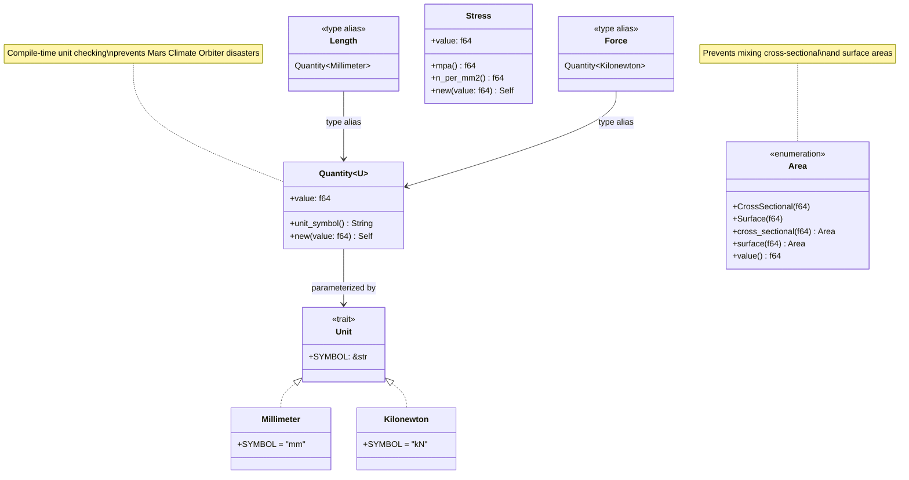

# 🦌 Gazelle Architecture Documentation

This document provides comprehensive Mermaid diagrams illustrating Gazelle's architecture, workflows, and design patterns.

## Table of Contents

- [System Architecture](#system-architecture)
- [Daemon Service Architecture](#daemon-service-architecture)
- [Type Safety System](#type-safety-system)
- [Analysis Workflow](#analysis-workflow)
- [Material Domain Model](#material-domain-model)
- [Client Ecosystem](#client-ecosystem)
- [Development Roadmap](#development-roadmap)

---

## System Architecture


---

## Daemon Service Architecture


---

## Type Safety System



---

## Analysis Workflow

```mermaid
flowchart TD
    Start([Start Analysis]) --> LoadModel[Load Structural Model]
    LoadModel --> ValidateModel{Validate Model}
    ValidateModel -->|Invalid| ValidationError[Validation Error]
    ValidateModel -->|Valid| ProcessMaterials[Process Materials]
    
    ProcessMaterials --> CreateConcrete[Create Type-Safe Concrete]
    CreateConcrete --> ValidateAge{Age ≥ 3 days?}
    ValidateAge -->|No| AgeError[Age Validation Error]
    ValidateAge -->|Yes| CalculateProperties[Calculate Material Properties]
    
    CalculateProperties --> AssembleMatrix[Assemble Global Matrix]
    AssembleMatrix --> CheckDOF[Check DOF Mapping]
    CheckDOF --> ApplyConstraints[Apply Boundary Conditions]
    
    ApplyConstraints --> DetectSingularity{Matrix Singular?}
    DetectSingularity -->|Yes| AutoConstrain[Apply Auto-constraints]
    AutoConstrain --> DetectSingularity
    DetectSingularity -->|No| ChooseAnalysis{Analysis Type}
    
    ChooseAnalysis -->|Static| StaticSolver[Static Linear Solver]
    ChooseAnalysis -->|Modal| ModalSolver[Eigenvalue Solver]
    ChooseAnalysis -->|Dynamic| DynamicSolver[Time Integration]
    
    StaticSolver --> ProcessResults[Process Results]
    ModalSolver --> ProcessResults
    DynamicSolver --> ProcessResults
    
    ProcessResults --> ValidateResults{Results Valid?}
    ValidateResults -->|No| SolverError[Convergence Error]
    ValidateResults -->|Yes| FormatOutput[Format Output]
    
    FormatOutput --> ChooseFormat{Output Format}
    ChooseFormat -->|JSON| JSONOutput[JSON Serialization]
    ChooseFormat -->|YAML| YAMLOutput[YAML Serialization]
    ChooseFormat -->|VTK| VTKOutput[VTK Export]
    
    JSONOutput --> Success([Analysis Complete])
    YAMLOutput --> Success
    VTKOutput --> Success
    
    ValidationError --> End([End])
    AgeError --> End
    SolverError --> End
    
    classDef process fill:#e8f5e8
    classDef decision fill:#fff3e0
    classDef error fill:#ffebee
    classDef success fill:#e1f5fe
    
    class LoadModel,ProcessMaterials,CreateConcrete,CalculateProperties,AssembleMatrix,CheckDOF,ApplyConstraints,AutoConstrain,StaticSolver,ModalSolver,DynamicSolver,ProcessResults,FormatOutput,JSONOutput,YAMLOutput,VTKOutput process
    class ValidateModel,ValidateAge,DetectSingularity,ChooseAnalysis,ValidateResults,ChooseFormat decision
    class ValidationError,AgeError,SolverError error
    class Start,Success,End success
```



---

## Material Domain Model


---

## Client Ecosystem


---

## Development Roadmap

```mermaid
timeline
    title Gazelle Development Roadmap
    
    2024 Q1-Q2 : Foundation Phase
                : Core Engine Implementation ✅
                : Type Safety System ✅
                : Test Suite & Validation ✅
    
    2024 Q3-Q4 : Architecture Phase  
                : Daemon Service Design ✅
                : HTTP API Implementation 🚧
                : Session Management 🚧
    
    2025 Q1    : Ecosystem Phase
                : Python Bindings 📋
                : CLI Enhancement 📋
                : Web Interface 📋
    
    2025 Q2-Q3 : Materials Phase
                : Steel Materials Library 📋
                : Design Code Plugins 📋
                : Advanced Concrete Models 📋
    
    2025 Q4    : Analysis Phase
                : Nonlinear Analysis 📋
                : Dynamic Analysis Enhancement 📋
                : Performance Optimization 📋
```



---

## REST API Endpoints

```mermaid
graph TD
    subgraph "Session Management"
        POST_S[POST /sessions<br/>Create analysis session]
        GET_S[GET /sessions<br/>List active sessions]
        GET_SI[GET /sessions/{id}<br/>Get session details]
        DEL_S[DELETE /sessions/{id}<br/>Delete session]
    end
    
    subgraph "Analysis Operations"
        POST_A[POST /sessions/{id}/analyze<br/>Run analysis]
        GET_R[GET /sessions/{id}/results<br/>Get cached results]
        POST_M[POST /sessions/{id}/model<br/>Update model]
    end
    
    subgraph "System Status"
        GET_ST[GET /status<br/>Daemon status]
        GET_H[GET /health<br/>Health check]
        GET_M[GET /metrics<br/>Performance metrics]
    end
    
    subgraph "Utilities"
        POST_V[POST /validate<br/>Validate model]
        POST_C[POST /convert<br/>Format conversion]
        GET_E[GET /examples<br/>Example models]
    end
    
    Client --> POST_S
    Client --> GET_S
    Client --> GET_SI
    Client --> DEL_S
    Client --> POST_A
    Client --> GET_R
    Client --> POST_M
    Client --> GET_ST
    Client --> GET_H
    Client --> GET_M
    Client --> POST_V
    Client --> POST_C
    Client --> GET_E
    
    classDef session fill:#e1f5fe
    classDef analysis fill:#e8f5e8
    classDef system fill:#fff3e0
    classDef util fill:#f3e5f5
    
    class POST_S,GET_S,GET_SI,DEL_S session
    class POST_A,GET_R,POST_M analysis
    class GET_ST,GET_H,GET_M system
    class POST_V,POST_C,GET_E util
```

---

## Error Handling Flow


---

This comprehensive Mermaid documentation provides visual clarity for:

1. **System Architecture** - Overall component relationships
2. **Daemon Service** - HTTP API interaction patterns
3. **Type Safety** - Compile-time safety mechanisms
4. **Analysis Workflow** - Engineering process flow
5. **Material Domain** - Engineering material modeling
6. **Client Ecosystem** - Multi-language integration
7. **Development Roadmap** - Project timeline and priorities
8. **API Endpoints** - REST interface organization
9. **Error Handling** - Robust failure management

These diagrams can be embedded directly in GitHub README files and will render automatically, providing immediate visual understanding of Gazelle's architecture and workflows.