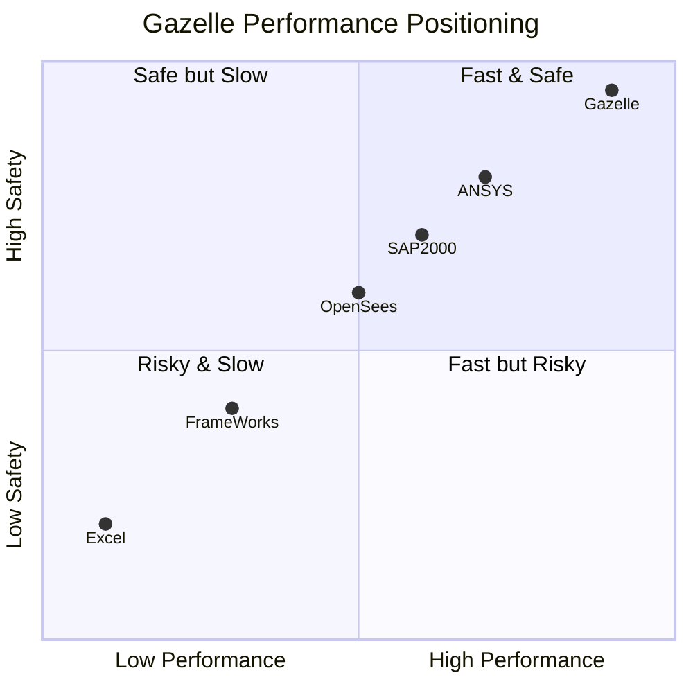
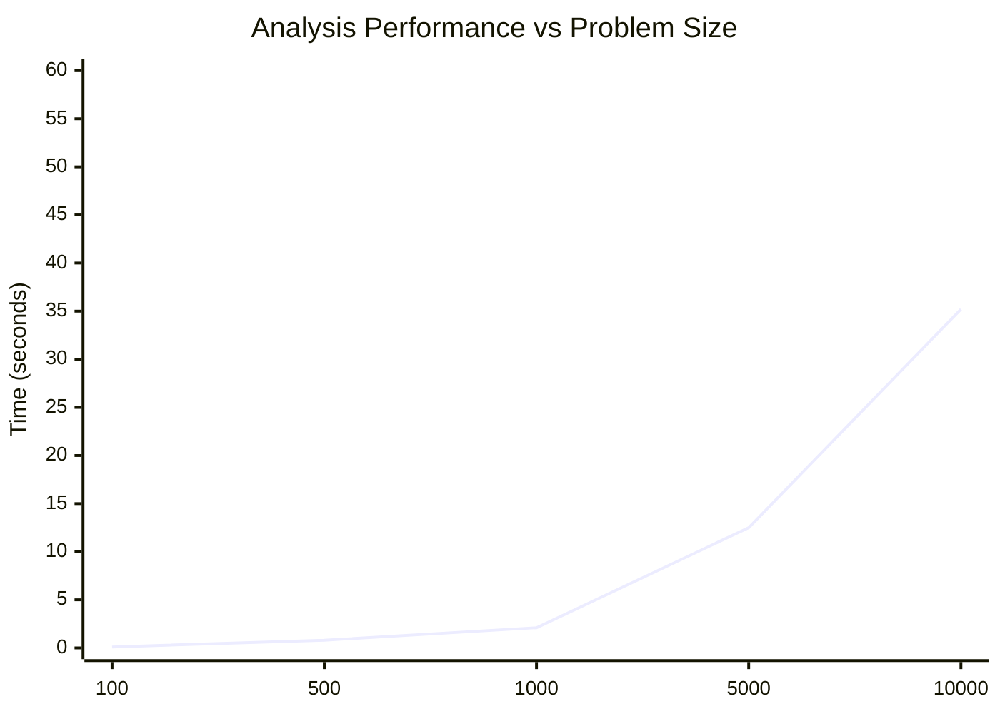

# 🦌 Gazelle Technical Stack

Visual overview of Gazelle's technical architecture and dependencies.

## Technology Stack

## Performance Characteristics

## Dependency Graph

## Build & Deploy Pipeline

```mermaid
flowchart TD
    Code[Source Code] --> Lint[cargo clippy]
    Lint --> Format[cargo fmt --check]
    Format --> Test[cargo test --all-features]
    
    Test --> UnitTests{Unit Tests<br/>23/23 ✅}
    Test --> DocTests{Doc Tests<br/>4/4 ✅}
    Test --> PropTests{Property Tests<br/>✅}
    
    UnitTests --> Build[cargo build --release]
    DocTests --> Build
    PropTests --> Build
    
    Build --> Package{Package Type}
    
    Package -->|Binary| CargoInstall[cargo install gazelle]
    Package -->|Container| Docker[docker build -t gazelle]
    Package -->|Python| Wheel[maturin build]
    
    CargoInstall --> Deploy[Deployment]
    Docker --> Deploy
    Wheel --> PyPI[PyPI Upload]
    PyPI --> Deploy
    
    Deploy --> Monitor[Performance Monitoring]
    Monitor --> Feedback[User Feedback]
    Feedback --> Code
```

## Memory & Performance Model

## Security Model

## Ecosystem Integration

This technical documentation provides developers with:

1. **Technology Stack** - Complete dependency overview
2. **Performance Positioning** - How Gazelle compares to alternatives
3. **Dependency Management** - Version requirements and relationships
4. **Build Pipeline** - CI/CD and quality gates
5. **Memory Model** - Resource usage patterns
6. **Security Architecture** - Safety and access control
7. **Ecosystem View** - Integration points and standards

These visualizations help both users and contributors understand Gazelle's technical foundation and architectural decisions.