# 🦌 Gazelle Quick Start Workflows

This document provides visual workflows for common Gazelle usage patterns.

## User Journey: First Analysis


## CLI Usage Flow

```mermaid
flowchart LR
    Start([Start]) --> Install[cargo install gazelle]
    Install --> Daemon[gazelle daemon --start]
    Daemon --> Create[gazelle create truss]
    Create --> Edit[Edit model.json]
    Edit --> Analyze[gazelle analyze model.json]
    Analyze --> Results[View results.json]
    Results --> Export[gazelle export --format vtk]
    Export --> Success([Analysis Complete])
```



## Python Integration


## Multi-Client Architecture


## Development Workflow

```mermaid
gitgraph
    commit id: "Initial commit"
    branch feature/materials
    checkout feature/materials
    commit id: "Add concrete materials"
    commit id: "Add steel materials"
    checkout main
    merge feature/materials
    
    branch feature/analysis
    checkout feature/analysis
    commit id: "Implement modal analysis"
    commit id: "Add nonlinear solver"
    checkout main
    merge feature/analysis
    
    branch feature/python-bindings
    checkout feature/python-bindings
    commit id: "PyO3 integration"
    commit id: "Python test suite"
    checkout main
    merge feature/python-bindings
    
    commit id: "Release v1.0.0"
    
    branch hotfix/stability
    checkout hotfix/stability
    commit id: "Fix convergence issue"
    checkout main
    merge hotfix/stability
    commit id: "Release v1.0.1"
```

## Testing Strategy


## Error Recovery Flow


This visual documentation helps users understand:

1. **User Journey** - The emotional experience of using Gazelle
2. **CLI Flow** - Step-by-step command line usage
3. **Python Integration** - How the Python bindings work
4. **Multi-Client** - System context and relationships
5. **Development** - How the project evolves
6. **Testing** - Quality assurance approach
7. **Error Recovery** - How to handle problems

These diagrams complement the technical architecture documentation and provide user-focused guidance.