# 🦌 Gazelle Quick Start Workflows

This document provides visual workflows for common Gazelle usage patterns.

## User Journey: First Analysis

```mermaid
graph LR
    subgraph "Getting Started 🚀"
        Install[Install Gazelle<br/>⭐⭐⭐⭐⭐]
        Daemon[Start daemon<br/>⭐⭐⭐⭐]
        Model[Create model<br/>⭐⭐⭐]
    end
    
    subgraph "Running Analysis 🔬"
        Upload[Upload model<br/>⭐⭐⭐⭐]
        Analyze[Run analysis<br/>⭐⭐⭐⭐⭐]
        Results[Get results<br/>⭐⭐⭐⭐⭐]
    end
    
    subgraph "Understanding Results 📊"
        Displace[View displacements<br/>⭐⭐⭐⭐]
        Stress[Check stresses<br/>⭐⭐⭐⭐]
        Export[Export to CAD<br/>⭐⭐⭐]
    end
    
    Install --> Daemon
    Daemon --> Model
    Model --> Upload
    Upload --> Analyze
    Analyze --> Results
    Results --> Displace
    Displace --> Stress
    Stress --> Export
    
    classDef start fill:#e1f5fe
    classDef analysis fill:#e8f5e8
    classDef results fill:#fff3e0
    
    class Install,Daemon,Model start
    class Upload,Analyze,Results analysis
    class Displace,Stress,Export results
```

## CLI Usage Flow

## Python Integration

## Multi-Client Architecture

## Development Workflow

## Testing Strategy

## Error Recovery Flow

This visual documentation helps users understand:

1. **User Journey** - The emotional experience of using Gazelle
2. **CLI Flow** - Step-by-step command line usage
3. **Python Integration** - How the Python bindings work
4. **Multi-Client** - System context and relationships
5. **Development** - How the project evolves
6. **Testing** - Quality assurance approach
7. **Error Recovery** - How to handle problems

These diagrams complement the technical architecture documentation and provide user-focused guidance.